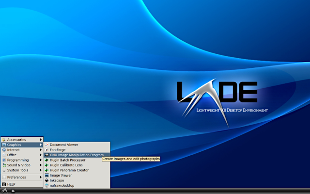
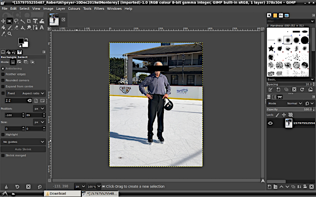
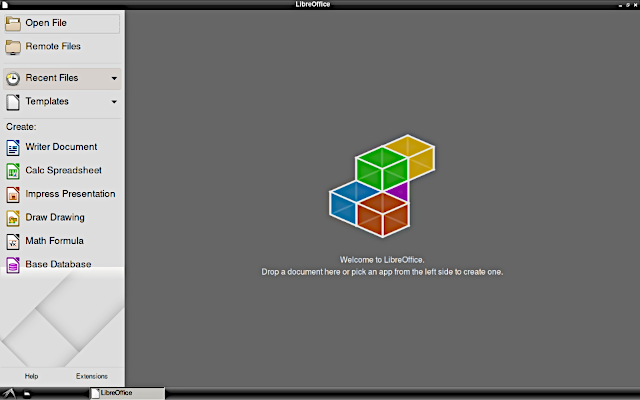

# alaterm
## LXDE Desktop for Arch Linux ARM on Termux Android
### No root

I have a 10.1in Samsung Galaxy Tab A 2019 WiFi tablet, no phone, not rooted. Using the Termux and VNC Viewer apps, I have been able to install Arch Linux ARM with an excellent LXDE desktop. Then, I can run GIMP, LibreOffice, and a variety of other programs that work with touchscreen or mouse and keyboard. Should work with a variety of devices that run 32-bit or 64-bit Android, but there is little benefit for small-screen devices.

Installation is very complex. For that purpose, I have written a lengthy BASH script that does it all, complete with configuration. When done, it "just works" with a selection of basic utility programs, and is ready for immediate installation of bigger programs.

The script is written for the benefit of those who have little or no knowledge of programming. It is not a fork of the well-known TermuxArch project.

### LIMITATIONS

Your device does not have a lot of computing power. So, although you can install some heavy-weight programs, they were designed for desktop computers. Your device may find that using them is stressful, especially when used with large files.

Multi-media programs are **not** supported. No audio. No video. Thus, no games. The reason is that multi-media programs require direct interface to the Android structure. Besides, your device is built for multi-media using native Android apps. Adding any kind of Linux capability brings no advantage.

### INSTALLATION (Android only, ARM processor only):

Look at the file INSTALL.md at this site. Simple. No-Brainer.
